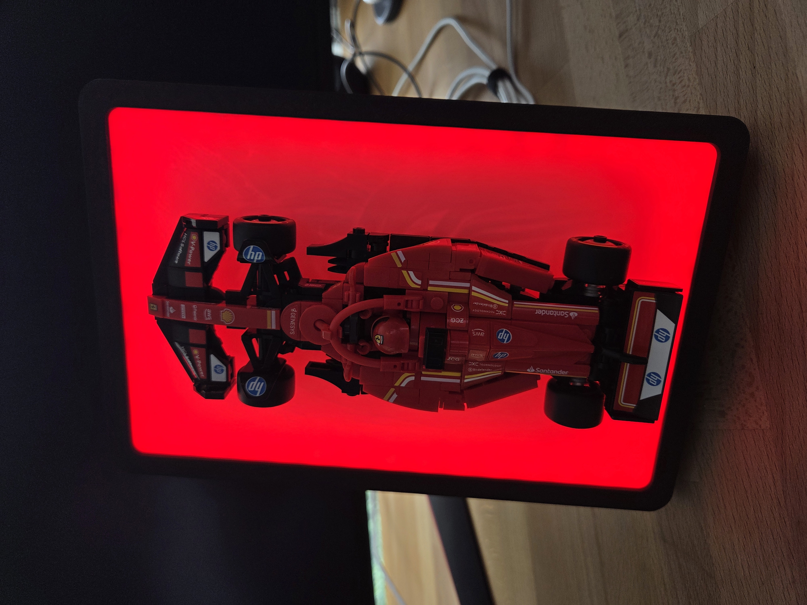
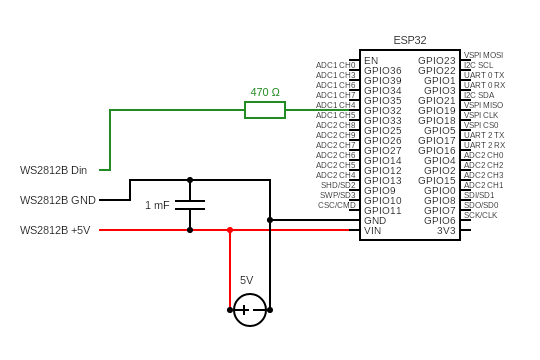
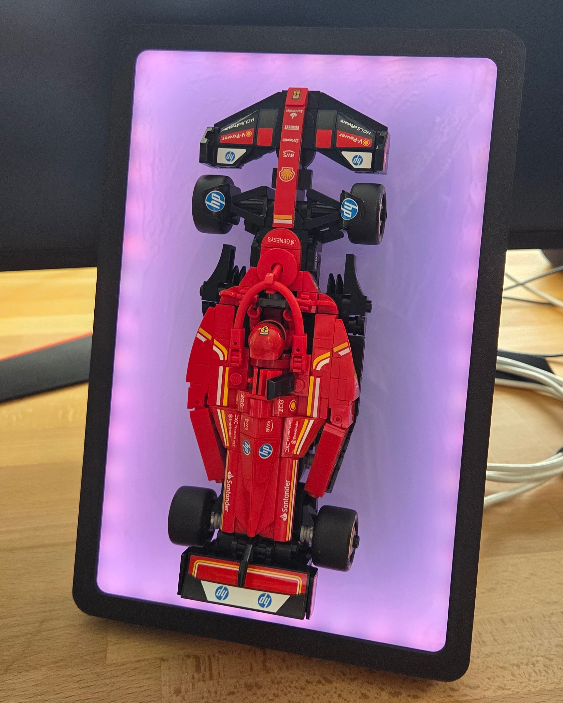
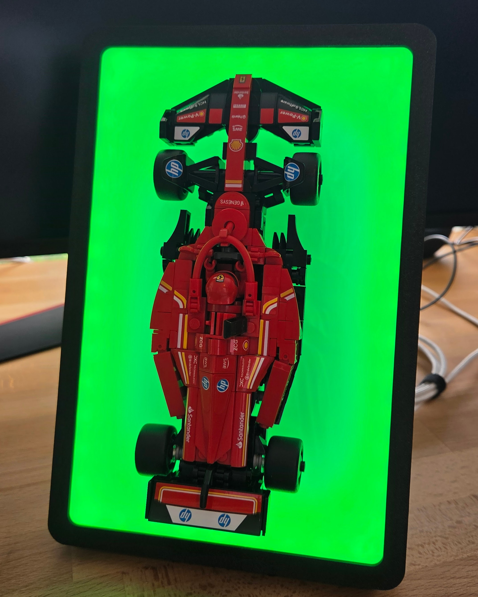

# F1 Race Status LED Sign

A real-time Formula 1 race status sign that displays the current track status (green flag, yellow flag, safety car, red flag, etc.).

<p align="center">
  
</p>


---

## How It Works

```
F1 Live Timing Stream → Raspberry Pi (FastF1 + Flask) → WiFi → ESP32 → LED Strip
```

1. A **Raspberry Pi** connects to F1's live timing stream using [FastF1](https://github.com/theOehrly/Fast-F1) and extracts the current track status
2. A **Flask server** on the Pi exposes the status at `http://PI_IP:5000/status`
3. The **ESP32** polls that endpoint every 10 seconds and updates the LED strip accordingly

---

## Hardware Required

### Sign Hardware
| Component | Notes |
|---|---|
| [ESP32](https://a.co/d/02YDu525) | While Arduino boards could work, most use single-core processors; the ESP32's dual cores allow for the smoothest animation by running api retrieval on the second core.
| [WS2812B LED strip](https://a.co/d/06bJ6InP) | I used a 48 LED long segment from the 16.4FT 300led Non-Waterproof varient |
| [USB-C Power supply](https://a.co/d/0aMuG7ML) | Revmove the connection at 12V to put it in 5V mode|
| 470Ω resistor |
| 1mF capacitor |
| 3D Printed Housing | All of the `.stl` files can be found [here](3D%20Print%20Files/)
| [Frosted Acrylic](https://a.co/d/0hzmmOPK) | I cut mine to 159mm x 244mm |
| [Protoboard](https://a.co/d/011fvpxh) | I used a 40 x 60mm board|
| M2 Screws | Used to attach the protoboard to the back
| [LEGO Speed Chapions F1 Car](https://www.lego.com/en-us/product/ferrari-sf-24-f1-race-car-77242) | *Forza Ferrari!*

### Other Hardware
| Component | Notes |
|---|---|
| Raspberry Pi | Model 3B+ or newer should work (I used a Model 4B) |
| Micro SD Card | Must be large enough to hold PiOS lite, server.py, & f1auth.json |
| Ethernet Cable (Optional) | Can be used to connect pi to network |

---

## Wiring



> **Important:** Never power the LED strip from the ESP32's 3.3V or 5V pins. Always use a dedicated 5V supply.

---

## LED Effects

| Status | Meaning | Effect |
|---|---|---|
| `0` | No session | Dim white |
| `1` | Green flag | Solid green |
| `2` | Yellow flag | Ribbon effect - yellow over green |
| `3` | SC Deployed | Pulse orange |
| `4` | Safety Car | Ribbon effect - orange over yellow |
| `5` | Red flag | Solid red |
| `6` | VSC Deployed | Pulse yellow |
| `7` | VSC Ending | Quickly flash yellow |
| - | Winner | Rotating team colour bands (30 mins after session end) |
| - | Server unreachable | Ribbon effect - red |
| - | Connecting to WiFi | Ribbon effect - white |

##
<p align="center">
  
  
</p>
<p align="center">
  
  
</p>
<p align="center">
  
  
</p>
<p align="center">
  
  
</p>

---

## Pi Server Setup

### Prerequisites

- Raspberry Pi running Raspberry [Pi OS Lite (64-bit)](https://www.raspberrypi.com/software/)
- Python 3 with pip
- An [F1TV](https://www.formula1.com/en-us/subscribe-to-f1-tv) subscription (required for live timing access)
  - This is a part of [Apple TV](https://www.apple.com/apple-tv) in the U.S.

### Installation

**1. Create a virtual environment and install dependencies:**
```bash
mkdir ~/f1sign
python3 -m venv ~/f1env
source ~/f1env/bin/activate
pip install fastf1 flask
```

**2. Copy `server.py` to the Pi:**
```powershell
scp server.py yourUsername@PI_IP:~/f1sign/server.py
```
> For all this process, replace 'yourUsername' with the username for your Pi

**3. Authenticate with F1TV on your main computer:**

Run a FastF1 script (i.e. server.py) on your PC to trigger the browser login. The token is saved at:
- Windows: `%LOCALAPPDATA%\fastf1\fastf1\f1auth.json`
- Mac/Linux: `~/.local/share/fastf1/f1auth.json`

**4. Copy the token to the Pi:**
```powershell
scp $env:LOCALAPPDATA\fastf1\fastf1\f1auth.json yourUsername@PI_IP:~/f1auth.json
```

```bash
mkdir -p ~/.local/share/fastf1
mv ~/f1auth.json ~/.local/share/fastf1/f1auth.json
```

**5. Set up as a systemd service:**
```bash
sudo nano /etc/systemd/system/f1sign.service
```

```ini
[Unit]
Description=F1 Sign Middleware Server
After=network-online.target
Wants=network-online.target

[Service]
Type=simple
User=yourUsername
WorkingDirectory=/home/yourUsername/f1sign
ExecStart=/home/yourUsername/f1env/bin/python /home/yourUsername/f1sign/server.py
Restart=on-failure
RestartSec=10

[Install]
WantedBy=multi-user.target
```

```bash
sudo systemctl daemon-reload
sudo systemctl enable f1sign
sudo systemctl start f1sign
```

### API Endpoints

| Endpoint | Description |
|---|---|
| `GET /status` | Current track status for the ESP32 |
| `GET /health` | More detailed server state for debugging |

### Token Renewal

F1TV authentication tokens expire approximately every 4 days. When the token expires, the stream file will stay at 0 bytes, and the sign will stop updating. Renew by re-authenticating on your PC and copying the fresh token to the Pi as described in steps 3–4 above, then run the command below. It is recommended to renew on the Thursday before each race weekend.

```bash
sudo systemctl restart f1sign
```
### IP Binding
In order for the ESP32 to connect to the API, the Pi must have a static IP address on the network. This can typically be done in your router's dashboard under a setting called IP Binding (_it can also be called IP reservation or DHCP reservation*). 

> While this feature is common on most consumer routers, some ISP-supplied routers do not support it. In this case, you will have to set a static IP address on the pi itself. (*This can cause potential issues if the router assigns that address to another device while the Pi is disconnected.*)

---

## ESP32 Setup

### Prerequisites

- Arduino IDE with the ESP32 board package installed
- Board package URL: `https://raw.githubusercontent.com/espressif/arduino-esp32/gh-pages/package_esp32_index.json`

### Libraries (install via Arduino Library Manager)

- **FastLED** by Daniel Garcia
- **ArduinoJson** by Benoit Blanchon

### Configuration

Create a `credentials.h` file in the same folder as the `.ino` file:

```cpp
#define WIFI_SSID     "YOUR_WIFI_SSID"
#define WIFI_PASSWORD "YOUR_WIFI_PASSWORD"
#define HOST_IP       "YOUR_PI_IP"
```

Update the hardware constants at the top of `f1_led_sign.ino` to match your setup:

```cpp
#define LED_PIN     32      // GPIO pin connected to LED strip data line
#define NUM_LEDS    48      // Total number of LEDs in your strip
#define LED_TYPE    WS2812B // WS2812B | WS2811 | SK6812
#define COLOR_ORDER GRB     // GRB for most WS2812B strips
```

### Notes

- GPIO 34, 35, 36, and 39 are input-only - do not use these for the LED data line
- The ESP32 runs LED animations on core 1 and HTTP polling on core 0, so animations run uninterrupted during network calls
- Ensure that `credentials.h` is added to `.gitignore` to keep WiFi credentials private

---

## Data Source

Live timing data is provided by [FastF1](https://github.com/theOehrly/Fast-F1), which connects to F1's SignalR live timing stream. A paid F1TV subscription is required for authenticated stream access.

The server tracks the following stream messages:

| Message | Purpose |
|---------|---------|
| `SessionStatus` | Detects session start, end, and finalisation |
| `TrackStatus` | Live flag status (green, yellow, SC, red, etc.) |
| `SessionInfo` | Session type (Race, Qualifying, Practice, etc.) |
| `TopThree` | Race/qualifying leader for winner colour display |

---

## Troubleshooting

**Sign shows dim white during an active session**
- Check that `SessionStatus: Started` has been received - the sign stays idle until the session officially begins
- Check the Pi server health endpoint for `session_active` and `session_ended` values

**Stream file stays at 0 bytes**
- The F1TV authentication token has likely expired - renew it as described above

**Sign shows server unreachable (red ribbon effect)**
- The ESP32 cannot reach the Pi - check the Pi IP address in `credentials.h` and that the service is running with `sudo systemctl status f1sign`

**Winner colours not showing after a session**
- Check `has_top_three` on the health endpoint - if `false` the TopThree data wasn't received
- Check `session_ended` - if `false` the Finalised message wasn't processed

---

## Sign Assembly

This sign can be assembled as shown in the model of all the parts found [here](https://www.tinkercad.com/things/cDd0Z8cSi8h-f1-sign?sharecode=n5SaTvh2zsZV61PfMoRx6sGg9GLg6rmgf1fMAjp3OLI). I used CA glue to hold all of the parts together.

> The Guide piece should not be glued in place; it is only used to help align the LEGO car mount

**Recommended Assembly Order**

1. Cut and glue the acrylic in the frame
2. Attach the LED strip as far from the frame as possible
3. Attach the protoboard (*with circuit*) to the Lower Back Panel
   - Tip: The provided connector with the LED strip makes it much easier to solder the circuit and LED separately and attach afterwards.
4. Glue the Lower and Upper Back Panel into place
5. Use the guide piece to glue the car mount to the acrylic

> The upper back panel has a wall hanger. If this is the desired method of display, ensure that the capacitor is attached to the circuit in such a way that it does not protrude too far from the back of the sign.

> The lower back panel has 2 holes for the stand piece to slot into. This does not have to be glued in place.

---

## Credits

- [FastF1](https://github.com/theOehrly/Fast-F1) by Oehrly - F1 live timing client
- [FastLED](https://github.com/FastLED/FastLED) by Daniel Garcia - LED control library
- [Flask](https://flask.palletsprojects.com) - lightweight Python web framework
- [carkingnemke on Thingiverse](https://www.thingiverse.com/thing:7006168) - The original 3d model for the mount that holds the LEGO car
