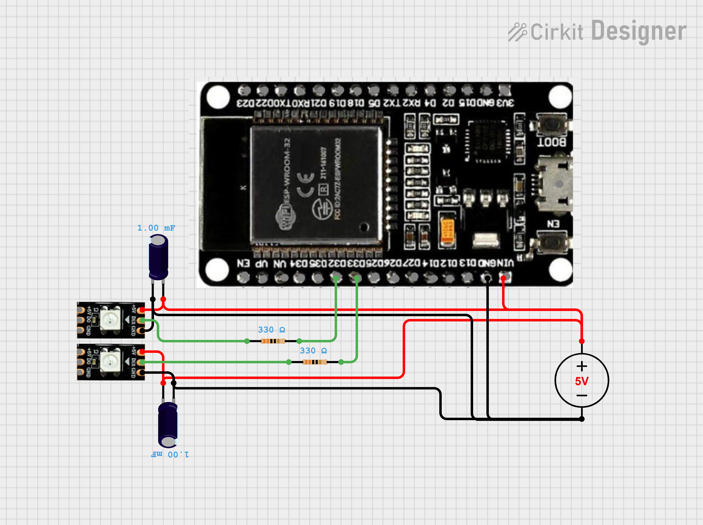

# F1 Race Status LED Sign

A real-time Formula 1 race status sign that displays the current track status (green flag, yellow flag, safety car, red flag, etc.).

<p align="center">
  <a href="https://youtube.com/watch?v=00ipvBSNEHg">
    
  </a>
</p>
> ▶️ Click to See Examples of the Various Statuses

---

## How It Works

```
F1 Live Timing Stream → Raspberry Pi (FastF1 + Flask) → WiFi → ESP32 → LED Strip
```

1. A **Raspberry Pi** connects to F1's live timing stream using [FastF1](https://github.com/theOehrly/Fast-F1) and extracts the current track status
2. A **Flask server** on the Pi exposes the status at `http://PI_IP:5000/status`
3. The **ESP32** polls that endpoint every 10 seconds and updates the LED strip accordingly

---

## Hardware Required

### Sign Hardware
| Component | Notes |
|---|---|
| [ESP32](https://a.co/d/00CtG8Fz) | While Arduino boards could work, most use single-core processors; the ESP32's dual cores allow for the smoothest animation by running api retrieval on the second core.
| [WS2812B LED strip](https://a.co/d/06bJ6InP) | I used 2 40 LED long segments from the 16.4FT 300led Non-Waterproof varient |
| [5V Power Supply](https://a.co/d/0e30fwZi) | |
| 330Ω Resistor | 1 for each strip 
| 1mF capacitor | 1 for each strip
| 3D Printed Housing | All of the `.stl` files can be found [here](3D%20Print%20Files/). I printed to white panels in Bambu Labs matte white with 100% infill.
| 3D Printed Track Layouts | All of the `.stl` files can be found [here](3D%20Print%20Files/Tracks) *(Optional)*
| [Protoboard](https://a.co/d/011fvpxh) | I used a 40 x 60mm board| *(Optional)*
| Various Wire |
| M2 Screws |
| [Heat set M2 Threaded Inserts](https://a.co/d/04uJB6CM) |
| CA Glue |
| [LEGO Speed Chapions F1 Car](https://www.lego.com/en-us/product/ferrari-sf-24-f1-race-car-77242) | *Forza Ferrari!*

### Other Hardware
| Component | Notes |
|---|---|
| Raspberry Pi | Model 3B+ or newer should work (I used a Model 4B 2GB) |
| Micro SD Card | Must be large enough to hold PiOS lite, server.py, & f1auth.json |

---

## Wiring



> **Important:** Never power the LED strip from the ESP32's 3.3V or 5V pins. Always use a dedicated 5V supply.

---

## LED Effects

| Status | Meaning | Effect |
|---|---|---|
| `0` | No session | Dim white |
| `1` | Green flag | Solid green |
| `2` | Yellow flag | Ribbon effect - yellow over green |
| `3` | SC Deployed | Pulse orange |
| `4` | Safety Car | Ribbon effect - orange over yellow |
| `5` | Red flag | Solid red |
| `6` | VSC Deployed | Pulse yellow |
| `7` | VSC Ending | Quickly flash yellow |
| - | Winner | Alternates between: rotating team colour bands & drivers' national flag colors (30 mins after session end) |
| - | Server unreachable | Ribbon effect - red |
| - | Connecting to WiFi | Ribbon effect - white |

## Pi Server Setup

### Prerequisites

- Raspberry Pi running Raspberry [Pi OS Lite (64-bit)](https://www.raspberrypi.com/software/)
- Python 3 with pip
- An [F1TV](https://www.formula1.com/en-us/subscribe-to-f1-tv) subscription (required for live timing access)
  - This is a part of [Apple TV](https://www.apple.com/apple-tv) in the U.S.

### Installation

**1. Create a virtual environment and install dependencies:**
```bash
mkdir ~/f1sign
python3 -m venv ~/f1env
source ~/f1env/bin/activate
pip install fastf1 flask
```

**2. Copy `server.py` to the Pi:**
```powershell
scp server.py yourUsername@PI_IP:~/f1sign/server.py
```
> For all this process, replace 'yourUsername' with the username for your Pi

**3. Authenticate with F1TV on your main computer:**

Run a FastF1 script (i.e. server.py) on your PC to trigger the browser login. The token is saved at:
- Windows: `%LOCALAPPDATA%\fastf1\fastf1\f1auth.json`
- Mac/Linux: `~/.local/share/fastf1/f1auth.json`

**4. Copy the token to the Pi:**
```powershell
scp $env:LOCALAPPDATA\fastf1\fastf1\f1auth.json yourUsername@PI_IP:~/f1auth.json
```

```bash
mkdir -p ~/.local/share/fastf1
mv ~/f1auth.json ~/.local/share/fastf1/f1auth.json
```

**5. Set up as a systemd service:**
```bash
sudo nano /etc/systemd/system/f1sign.service
```

```ini
[Unit]
Description=F1 Sign Middleware Server
After=network-online.target
Wants=network-online.target

[Service]
Type=simple
User=yourUsername
WorkingDirectory=/home/yourUsername/f1sign
ExecStart=/home/yourUsername/f1env/bin/python /home/yourUsername/f1sign/server.py
Restart=on-failure
RestartSec=10

[Install]
WantedBy=multi-user.target
```

```bash
sudo systemctl daemon-reload
sudo systemctl enable f1sign
sudo systemctl start f1sign
```

### API Endpoints

| Endpoint | Description |
|---|---|
| `GET /status` | Current track status for the ESP32 |
| `GET /health` | More detailed server state for debugging |

### Token Renewal

F1TV authentication tokens expire approximately every 4 days. When the token expires, the stream file will stay at 0 bytes, and the sign will stop updating. Renew by re-authenticating on your PC and copying the fresh token to the Pi as described in steps 3–4 above, then run the command below. It is recommended to renew on the Thursday before each race weekend.

```bash
sudo systemctl restart f1sign
```
### IP Binding
In order for the ESP32 to connect to the API, the Pi must have a static IP address on the network. This can typically be done in your router's dashboard under a setting called IP Binding (_it can also be called IP reservation or DHCP reservation*). 

> While this feature is common on most consumer routers, some ISP-supplied routers do not support it. In this case, you will have to set a static IP address on the pi itself. (*This can cause potential issues if the router assigns that address to another device while the Pi is disconnected.*)

---

## ESP32 Setup

### Prerequisites

- Arduino IDE with the ESP32 board package installed
- Board package URL: `https://raw.githubusercontent.com/espressif/arduino-esp32/gh-pages/package_esp32_index.json`

### Libraries (install via Arduino Library Manager)

- **FastLED** by Daniel Garcia
- **ArduinoJson** by Benoit Blanchon

### Configuration

Create a `credentials.h` file in the same folder as the `.ino` file:

```cpp
#define WIFI_SSID     "YOUR_WIFI_SSID"
#define WIFI_PASSWORD "YOUR_WIFI_PASSWORD"
#define HOST_IP       "YOUR_PI_IP"
```

Update the hardware constants at the top of `f1_led_sign.ino` to match your setup:

```cpp
#define LED_PIN     32      // GPIO pin connected to LED strip data line
#define NUM_LEDS    48      // Total number of LEDs in your strip
#define LED_TYPE    WS2812B // WS2812B | WS2811 | SK6812
#define COLOR_ORDER GRB     // GRB for most WS2812B strips
```

### Notes

- GPIO 34, 35, 36, and 39 are input-only - do not use these for the LED data line
- The ESP32 runs LED animations on core 1 and HTTP polling on core 0, so animations run uninterrupted during network calls
- Ensure that `credentials.h` is added to `.gitignore` to keep WiFi credentials private
- If the sketch is too large to be uploaded, go to **Tools -> Partition Scheme** and select **"Huge APP"**

---

## Data Source

Live timing data is provided by [FastF1](https://github.com/theOehrly/Fast-F1), which connects to F1's SignalR live timing stream. A paid F1TV subscription is required for authenticated stream access.

The server tracks the following stream messages:

| Message | Purpose |
|---------|---------|
| `SessionStatus` | Detects session start, end, and finalisation |
| `TrackStatus` | Live flag status (green, yellow, SC, red, etc.) |
| `SessionInfo` | Session type (Race, Qualifying, Practice, etc.) |
| `TopThree` | Race/qualifying leader for winner colour display |

---

## Troubleshooting

**Sign shows dim white during an active session**
- Check that `SessionStatus: Started` has been received - the sign stays idle until the session officially begins
- Check the Pi server health endpoint for `session_active` and `session_ended` values

**Stream file stays at 0 bytes**
- The F1TV authentication token has likely expired - renew it as described above

**Sign shows server unreachable (red ribbon effect)**
- The ESP32 cannot reach the Pi - check the Pi IP address in `credentials.h` and that the service is running with `sudo systemctl status f1sign`

**Winner colours not showing after a session**
- Check `has_top_three` on the health endpoint - if `false` the TopThree data wasn't received
- Check `session_ended` - if `false` the Finalised message wasn't processed

---

## Sign Assembly

It is recommended that the main part of the sign be cut in your printer's slicer software before printing to avoid large supports for the upper section.

Once all of the parts are printed, assemble as follows:

1. Use CA glue to attach the 2 panels to the main part of the sign housing
   - Allow proper time for the glue to dry before placing the car on the lower panel 
2. Use a soldering iron to press the threaded inserts into the sign housing
   - 4 on the bottom and 4 on the back
3. Use the adhesive backing to attach the LED strips to both sections on the housing
   - Place the strips so that they are as far from the panel as possible to achieve the best light diffusion 
   - It may be easier to solder wires onto the strips before installing them
4. Solder the circuit and place it into the rear portion of the housing
5. Use 8 M2 screws to attach the back bottom panels to the sign
6. *(Optional)* Place the next upcoming track layout into its slot on the upper lighting part of the sign
7. Place LEGO F1 car onto the sign

---

## Credits

- [FastF1](https://github.com/theOehrly/Fast-F1) by Oehrly - F1 live timing client
- [FastLED](https://github.com/FastLED/FastLED) by Daniel Garcia - LED control library
- [Flask](https://flask.palletsprojects.com) - lightweight Python web framework
- [f1-circuits-svg](https://github.com/julesr0y/f1-circuits-svg) by julesr0y - Used to create all of the track print files
